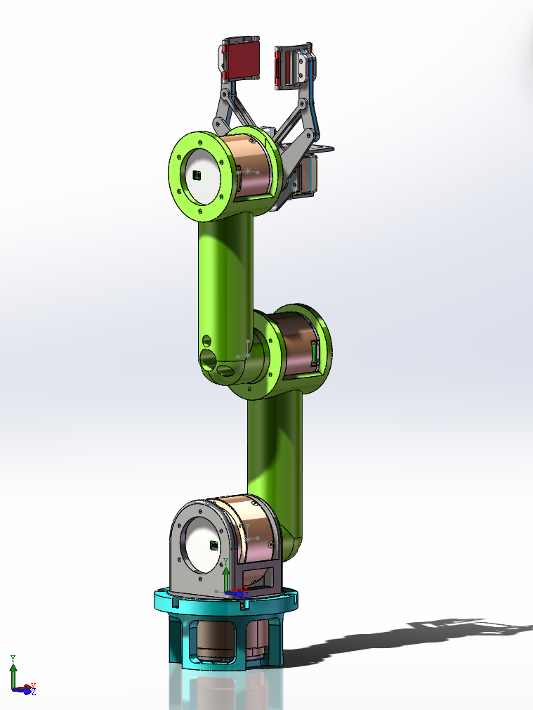

# RobotArm305运动学运动学仿真及控制代码实现

基于2023工创赛高工305物流车机械臂

### 仿真模型文件获取

**1.sw模型基准面修正；**

参考教程：

【新手必会技巧！solidworks零件视图歪了？三种操作教你如何摆正！】 https://www.bilibili.com/video/BV1oP411y7b1/?share_source=copy_web&vd_source=a60cef1f9c05dd5a70c97ee1ae8edf98；

**2.sw转urdf；**

参考教程：

【SolidWorks模型导出urdf   （古月居老师）】 https://www.bilibili.com/video/BV1Tx411o7rH/?share_source=copy_web&vd_source=a60cef1f9c05dd5a70c97ee1ae8edf98；

### 运动学正逆解

机械臂模型图：

运动学正解：

模型参数：（基于标准D-H系参数）

| 关节（$i$） | 臂长（$d_i$） | `    |      |      |
| ----------- | ------------- | ---- | ---- | ---- |
|             |               |      |      |      |
|             |               |      |      |      |
|             |               |      |      |      |
|             |               |      |      |      |

